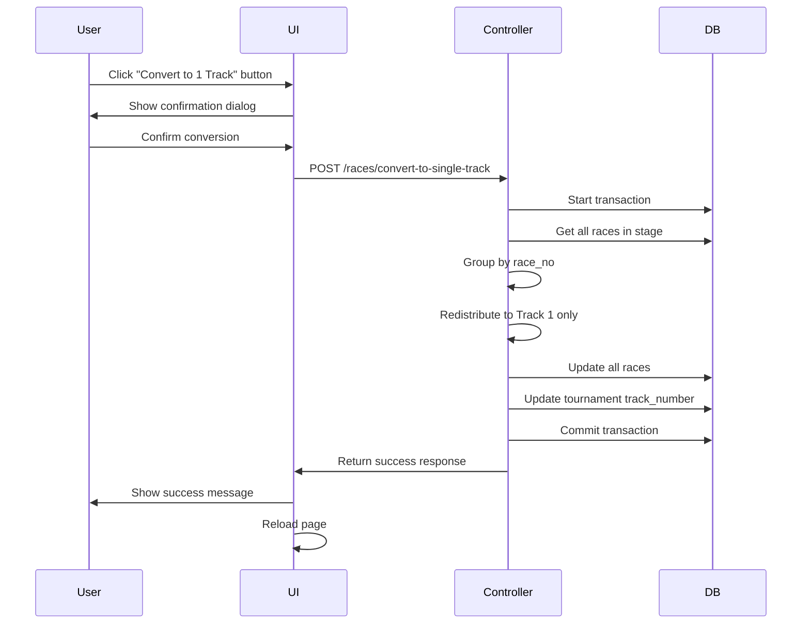

# Convert to 1 Track Feature - Implementation Plan

## Overview
Convert all races in a selected stage from multiple tracks to use only 1 track (Track 1 with lanes A, B, C).

## Example Scenario
**Before Conversion (track_number = 2):**
- Race 1: ABCDEF (6 racers across 2 tracks)
- Race 2: ABCDE (5 racers across 2 tracks)

**After Conversion (track = 1 only):**
- Race 1: ABC (from original Race 1's ABC)
- Race 2: ABC (from original Race 1's DEF)
- Race 3: ABC (from original Race 2's ABC)
- Race 4: AB (from original Race 2's DE)

## Algorithm
1. Get all races in the selected stage
2. Group races by race_no
3. For each original race_no:
   - Collect all racers from all tracks (A, B, C, D, E, F, etc.)
   - Redistribute into new races using only Track 1 (lanes A, B, C)
   - Each new race holds up to 3 racers (one per lane)
4. Update all races with new race_no, track=1, and new lane assignments
5. Update tournament's track_number to 1

## Implementation Steps

### 0. Add Language Strings
**Files:**
- `lang/en/messages.php`
- `lang/id/messages.php`

Add new language keys:
- `convert_to_single_track` - Button label
- `convert_to_single_track_title` - Modal title
- `convert_to_single_track_message` - Modal message/warning
- `convert` - Submit button label

### 1. Backend - Add Controller Method
**File:** `app/Http/Controllers/RaceController.php`

Add a new method `convertToSingleTrack()` that:
- Validates the request (stage is required)
- Uses database transaction for data integrity
- Retrieves all races in the specified stage
- Groups races by race_no
- Converts races to use only Track 1
- Updates tournament's track_number to 1
- Returns success/error response

### 2. Backend - Add Route
**File:** `routes/web.php`

Add a new route:
```php
Route::post('/races/convert-to-single-track', [RaceController::class, 'convertToSingleTrack'])
    ->name('tournament.races.convertToSingleTrack');
```

### 3. Frontend - Add Button
**File:** `resources/views/dashboard.blade.php`

Add a "Convert to 1 Track" button in the "Quick Actions" card, below the "Balance Races" button (after line 193):
- Add a new button with appropriate styling (e.g., btn-purple or btn-dark)
- Link to a modal for confirmation
- Include an icon (e.g., fas fa-compress-arrows-alt)

### 4. Frontend - Add Modal
**File:** `resources/views/dashboard.blade.php`

Add a new modal (after the Balance Races Modal, after line 400):
- Modal ID: `convertToSingleTrackModal`
- Stage selection dropdown (similar to Balance Races modal)
- Warning message about the conversion
- Confirm and Cancel buttons

### 5. Frontend - Add JavaScript
**File:** `resources/views/dashboard.blade.php`

Add JavaScript in the `@section('js')` section to handle:
- Modal form submission
- AJAX request to backend
- Success/error handling
- Page reload after conversion
- Loading state on submit button

## Data Flow



## Conversion Logic Details

### Input
- Stage: 2
- Original races:
  - Race 1: Track 1 (A, B, C), Track 2 (D, E, F)
  - Race 2: Track 1 (A, B, C), Track 2 (D, E)

### Process
1. Collect all racers from Race 1: [A, B, C, D, E, F]
2. Create new races:
   - New Race 1: Track 1, Lanes [A, B, C] (from original A, B, C)
   - New Race 2: Track 1, Lanes [A, B, C] (from original D, E, F)
3. Collect all racers from Race 2: [A, B, C, D, E]
4. Create new races:
   - New Race 3: Track 1, Lanes [A, B, C] (from original A, B, C)
   - New Race 4: Track 1, Lanes [A, B, C] (from original D, E, empty)

### Output
- Race 1: Track 1, Lanes A, B, C
- Race 2: Track 1, Lanes A, B, C
- Race 3: Track 1, Lanes A, B, C
- Race 4: Track 1, Lanes A, B, C (lane C is empty)

## Edge Cases to Handle

1. **No races in stage**: Return error message
2. **Already using 1 track**: Return info message
3. **Empty lanes**: Some new races may have empty lanes (less than 3 racers)
4. **Race times**: Preserve existing race_time values
5. **is_called status**: Preserve existing is_called status
6. **Transaction rollback**: Handle errors and rollback changes

## Validation Rules

- Stage must be provided and valid
- Stage must have races
- Tournament must be active

## Success Criteria

- All races in the stage use only Track 1
- All racers are redistributed correctly
- No data is lost
- Tournament track_number is updated to 1
- User receives clear feedback
- Page reloads to show converted races

## Files to Modify

1. `app/Http/Controllers/RaceController.php` - Add convertToSingleTrack method
2. `routes/web.php` - Add new route
3. `resources/views/dashboard.blade.php` - Add button, modal, and JavaScript handler
4. `lang/en/messages.php` - Add English language strings
5. `lang/id/messages.php` - Add Indonesian language strings

## Language Strings

### English (lang/en/messages.php)
Add to the Quick Actions section (around line 42):
```php
'convert_to_single_track' => 'Convert to 1 Track',
'convert' => 'Convert',
```

Add to the Modal section (around line 64):
```php
'convert_to_single_track_title' => 'Convert to 1 Track',
'convert_to_single_track_message' => 'This will convert all races in the selected stage to use only 1 track (Track 1 with lanes A, B, C). All racers will be redistributed into new races. This action cannot be undone.',
```

### Indonesian (lang/id/messages.php)
Add to the Quick Actions section:
```php
'convert_to_single_track' => 'Convert ke 1 Track',
'convert' => 'Convert',
```

Add to the Modal section:
```php
'convert_to_single_track_title' => 'Convert ke 1 Track',
'convert_to_single_track_message' => 'Ini akan mengubah semua race di babak yang dipilih untuk menggunakan hanya 1 track. Semua race akan didistribusikan ulang ke race baru. Tindakan ini tidak dapat dibatalkan.',
```

## Testing Checklist

- [ ] Convert stage with 2 tracks and multiple races
- [ ] Convert stage with 3+ tracks
- [ ] Convert stage with empty races
- [ ] Try converting already-converted stage
- [ ] Verify race times are preserved
- [ ] Verify is_called status is preserved
- [ ] Verify tournament track_number is updated
- [ ] Test error handling (no races, invalid stage)
