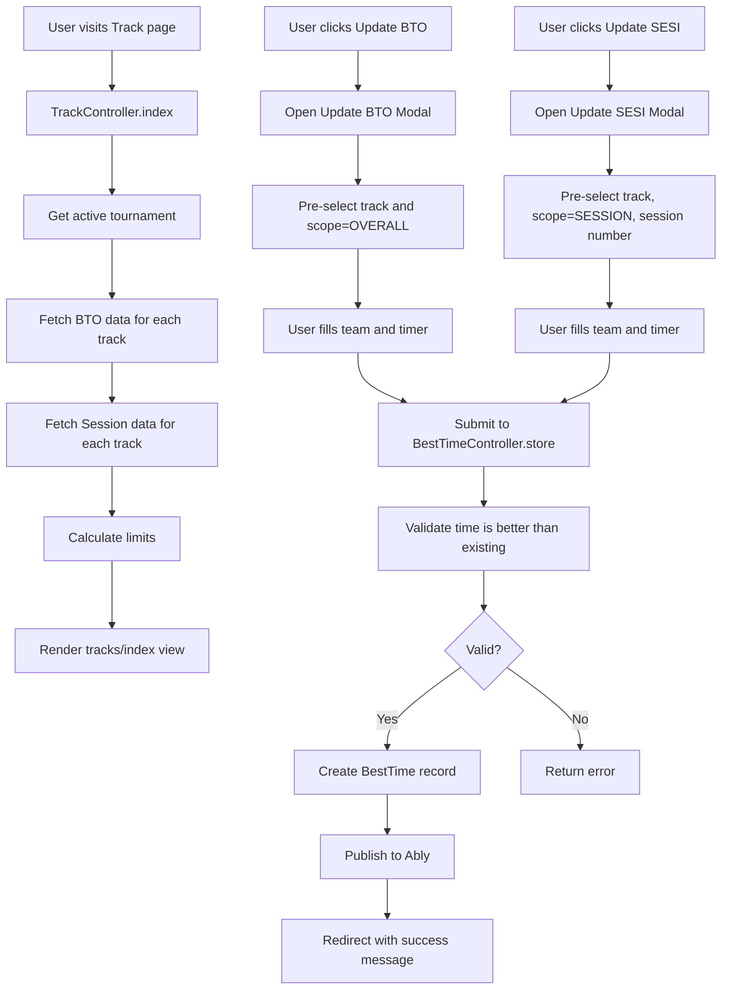

# Track Management Page - Implementation Plan

## Overview
Create a new Track management page to manage track (BTO, SESSION) data in an easy-to-use interface with dynamic card-based layout.

## Requirements

### Page Structure
- **Dynamic Track Cards**: Display one card per track based on `tournament.track_number`
- **Responsive Layout**: 
  - 2 tracks → col-6 (2 columns)
  - 3 tracks → col-4 (3 columns)
  - 4 tracks → col-3 (4 columns)
  - 5 tracks → col-2 (5 columns, with one on new row)
  - 6 tracks → col-2 (6 columns, 3 rows)

### Track Card Information
Each track card should display:

1. **BTO (Best Time Overall) Section**:
   - Current BTO timer
   - Current BTO team

2. **Session Section**:
   - Current BTO session number
   - Current BTO session timer
   - Current BTO session team

3. **Limit Calculation**:
   - Current limit = BTO + 1:50 (BTO timer + 150 centiseconds)

### Action Buttons
Each track card should have two buttons:

1. **Update BTO Button**:
   - Opens modal similar to best_times.index "Record New Best Time" modal
   - Automatically pre-selects:
     - Track = based on which card was clicked
     - Scope = OVERALL
   - User only needs to fill:
     - Team
     - Timer
   - Validation: Only record times better than existing OVERALL records for same track

2. **Update SESI Button**:
   - Opens modal similar to best_times.index "Record New Best Time" modal
   - Automatically pre-selects:
     - Track = based on which card was clicked
     - Scope = SESSION (current session)
     - Session number = tournament.current_bto_session
   - User only needs to fill:
     - Team
     - Timer
   - Validation: Only record times better than existing SESSION records for same track and session

## Implementation Plan

### 1. Create TrackController
**File**: `app/Http/Controllers/TrackController.php`

**Responsibilities**:
- Retrieve active tournament
- Fetch BTO data (OVERALL scope) for each track
- Fetch Session data (SESSION scope) for current session
- Calculate limit for each track
- Get teams for dropdowns
- Pass data to view

**Methods**:
```php
public function index()
```

### 2. Create Track View
**File**: `resources/views/tracks/index.blade.php`

**Structure**:
- Page header with tournament name
- Dynamic row with track cards
- Each card displays:
  - Track number header
  - BTO section (timer, team)
  - Session section (number, timer, team)
  - Limit display
  - Action buttons (Update BTO, Update SESI)
- Two modals:
  - Update BTO Modal
  - Update SESI Modal

**Column Logic**:
```php
@php
$colClass = match($tournament->track_number) {
    2 => 'col-6',
    3 => 'col-4',
    4 => 'col-3',
    default => 'col-2'
};
@endphp
```

### 3. Add Route
**File**: `routes/web.php`

Add route in tournament routes group:
```php
Route::get('/tracks', [TrackController::class, 'index'])->name('tracks.index');
```

### 4. Add Navigation Link
**File**: `config/adminlte.php`

Add menu item in TOURNAMENT MENU section:
```php
[
    'text' => 'Tracks',
    'route' => 'tournament.tracks.index',
    'icon' => 'fas fa-fw fa-road',
    'can' => 'accessTournament',
    'active' => ['tournament/tracks*'],
],
```

### 5. Reuse BestTimeController
The modals will submit to existing BestTimeController methods:
- `POST /tournament/best_times/store` for creating new records
- Validation logic already exists in BestTimeController

## Data Flow



## Track Card Layout Design

```
┌─────────────────────────────────┐
│     TRACK 1                      │
├─────────────────────────────────┤
│ BTO (OVERALL)                   │
│ Timer: 14:20                    │
│ Team: Team A                    │
├─────────────────────────────────┤
│ SESSION 1                       │
│ Timer: 15:30                    │
│ Team: Team B                    │
├─────────────────────────────────┤
│ LIMIT: 16:10 (BTO + 1:50)      │
├─────────────────────────────────┤
│ [Update BTO] [Update SESI]     │
└─────────────────────────────────┘
```

## Modal Design

### Update BTO Modal
- Title: "Update BTO - Track X"
- Pre-filled fields:
  - Track: Track X (disabled/hidden)
  - Scope: OVERALL (disabled/hidden)
- User fields:
  - Team (dropdown)
  - Timer (text input, format MM:SS)
- Submit button: "Update BTO"

### Update SESI Modal
- Title: "Update SESI - Track X (Session Y)"
- Pre-filled fields:
  - Track: Track X (disabled/hidden)
  - Scope: SESSION (disabled/hidden)
  - Session: Y (disabled/hidden)
- User fields:
  - Team (dropdown)
  - Timer (text input, format MM:SS)
- Submit button: "Update SESI"

## Technical Details

### Limit Calculation
```php
// Convert BTO timer to centiseconds
$btoCentiseconds = (int)explode(':', $btoTimer)[0] * 100 + (int)explode(':', $btoTimer)[1];

// Add 150 centiseconds (1:50)
$limitCentiseconds = $btoCentiseconds + 150;

// Convert back to timer format
$limitSeconds = floor($limitCentiseconds / 100);
$limitCenti = $limitCentiseconds % 100;
$limitTimer = sprintf('%d:%02d', $limitSeconds, $limitCenti);
```

### Data Queries
```php
// Get BTO data for all tracks
$btoData = BestTime::where('tournament_id', $tournament->id)
    ->where('scope', 'OVERALL')
    ->with('team')
    ->get()
    ->keyBy('track');

// Get Session data for current session
$sessionData = BestTime::where('tournament_id', $tournament->id)
    ->where('scope', 'SESSION')
    ->where('session_number', $tournament->current_bto_session)
    ->with('team')
    ->get()
    ->keyBy('track');
```

## Files to Create/Modify

### New Files
1. `app/Http/Controllers/TrackController.php`
2. `resources/views/tracks/index.blade.php`

### Modified Files
1. `routes/web.php` - Add track route
2. `config/adminlte.php` - Add navigation menu item

## Success Criteria
- [ ] Track page displays correct number of cards based on tournament.track_number
- [ ] Cards use appropriate column classes for clean layout
- [ ] Each card shows current BTO timer, team, session info, and calculated limit
- [ ] Update BTO button opens modal with pre-selected track and scope=OVERALL
- [ ] Update SESI button opens modal with pre-selected track, scope=SESSION, and session number
- [ ] Modals only require team and timer input
- [ ] Validation prevents recording worse times than existing records
- [ ] Navigation link appears in sidebar under TOURNAMENT MENU
- [ ] Page is accessible only to users with active tournament context
